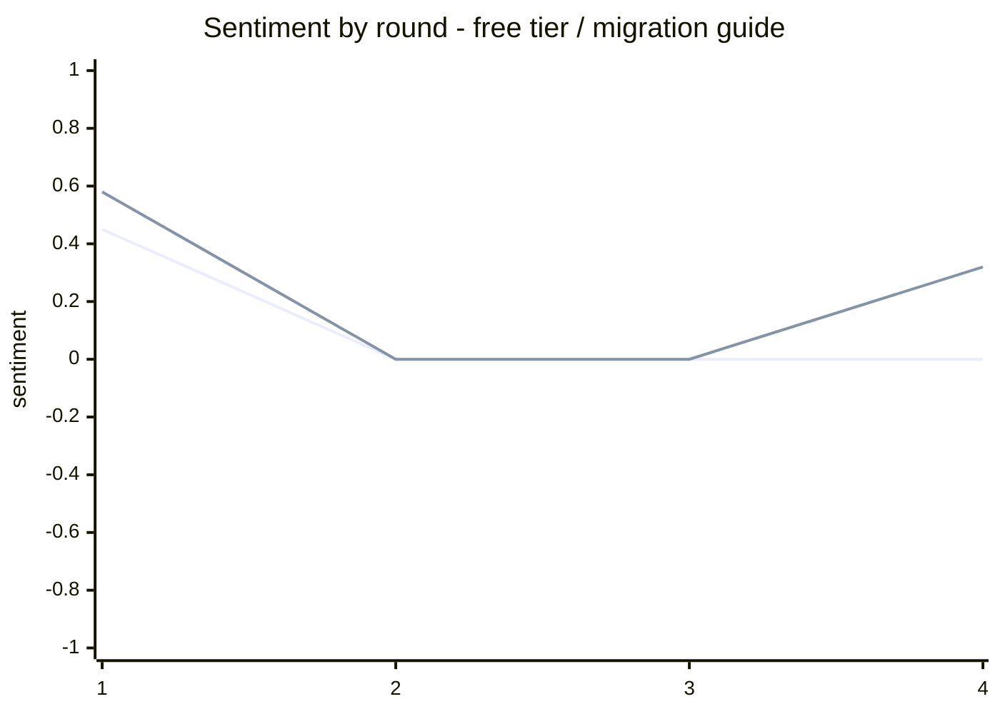
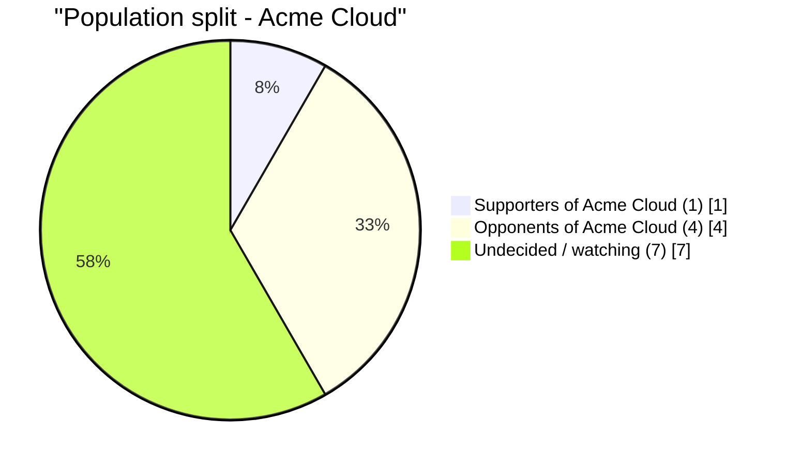
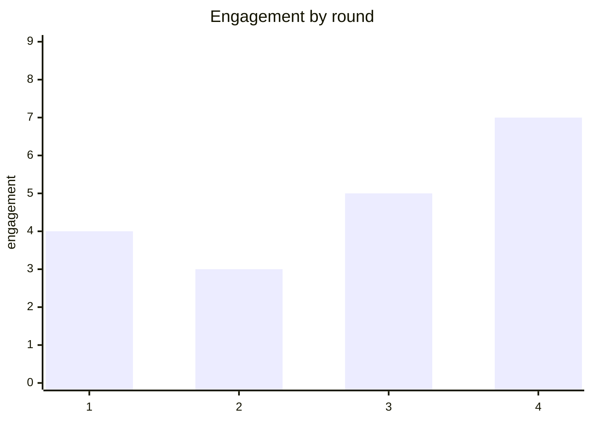

# Murmur Reaction Simulation Report — acme-pricing-reaction

> **Simulated perspective, not a validated forecast — every persona, post and metric in this report is generated by the Murmur engine, not observed from real users, and the projection section is a simulated perspective, not a claim about the future.**

**Version** 1 · **Scenario** `acme-pricing-reaction` · **Generated** 2026-09-26 · **Seed** `host-llm-flagship-01`

**Rounds** 4 · **Population** 12 personas · **Ontology** 15 entities · **Platforms** Twitter + Reddit

**Focus** — developer community reaction to the Acme Cloud pricing change

> Deterministic statistics computed by the Murmur engine; narrative drafted by the host coding agent around those numbers. Reproduce this report by re-running world `acme-pricing-reaction` with seed `host-llm-flagship-01` and the same host model — every number below is a pure function of the recorded run.

---

## At a Glance

| Simulated posts | Total engagement | Escalation chains | Viral posts | Controversy | Momentum | Most-discussed entity |
|---|---|---|---|---|---|---|
| 19 | 19 | 0 | 0 | **low-stakes** 13/100 | accelerating (+71%) | free tier |

**Verdict —** 1 supporter vs 4 opponents around Acme Cloud (7 still undecided) — the population is leaning one way. Controversy reads **low-stakes** (13/100).

## 1. Executive Summary

Verdict: this is a documentation failure being read as a pricing betrayal, and it is not going to escalate into a backlash. Across 19 posts and 12 engagement points the crowd stayed cold, not hot: controversy scored 16 out of 100 (low-stakes), polarization sat at 29/100, and zero escalation chains formed over 4 rounds. The decisive number is faction share, not sentiment: only 1 of 12 personas (8 percent) ended a supporter and 4 (33 percent) as opponents, while 7 (58 percent) stayed undecided at avg stance -0.05. That undecided bloc carried 13 engagement points, more than supporters (3) and opponents (3) combined. The single most-engaged post in the run was not an attack on Acme Cloud but a confused student asking how to claim the amnesty form (6 points). Momentum cooled -29 percent second half to first. The pricing itself is defensible; the FAQ is not.

## 2. Scenario & Population

A 40 percent Pro plan increase plus a free-tier cut (3 projects to 1, 5000 to 1000 requests/hr), announced with a 6-month grandfather window, free-forever exports, and a buried amnesty form. A competitor shipped a one-click import tool within a day. 12 personas, 4 rounds, 19 posts, 12 total engagement.

### Entities under watch

| Entity | Type | Salience | Mentions | Motive |
|---|---|---|---|---|
| Acme Cloud | org | 1.00 | 1 | fund reliability work and a new observability layer |
| developer community | topic | 0.95 | 0 | decide whether to stay or churn |
| Pro plan | product | 0.95 | 0 | monetize the most active developers |
| Nimbus Labs | org | 0.90 | 0 | poisson Acme Cloud's developer base |
| free tier | product | 0.90 | 5 | push hobbyists onto paid plans |
| churn threat | idea | 0.80 | 0 | pressure Acme Cloud to reverse course |
| StackHaven | org | 0.75 | 1 | recruit departing Acme Cloud developers |
| migration guide | product | 0.70 | 3 | explain the transition to customers |

### Population mix

| Archetype | Personas | Platforms |
|---|---|---|
| casual scroller | 2 | reddit + twitter |
| curious newcomer | 2 | both |
| industry professional | 2 | reddit + twitter |
| passionate advocate | 2 | reddit + twitter |
| power user | 2 | both + twitter |
| pragmatic skeptic | 2 | reddit + twitter |

## 3. Key Findings

1. **The undecided bloc was 58 percent of the population (7 of 12) but held 13 of 19 engagement points, more than the supporter and opponent factions combined, making uncertainty rather than anger the dominant state.**
2. **Controversy scored 16/100 (low-stakes) with polarization at 29/100 and 0 escalation chains across 4 rounds, so the announcement never developed an escalation cascade in this run.**
3. **The top-engagement item was po_10 at 6 points, a newcomer asking whether the student amnesty needs a form, beating every substantive pro and con argument in the run.**
4. **Momentum cooled -29 percent (7 to 5) between the first and second half, with engagement peaking in round 4 at 6 after the competitor import was confirmed working.**
5. **Free tier was the highest-volume contested entity at 9 posts, trending down -0.13, and 5 of 8 tracked stance movers shifted on it, mostly from negative toward less negative.**

## 4. Market Reaction

### Sentiment toward the top entities



Lines, in chart order: **free tier**, **migration guide**.

### Entity trend

| Entity | Type | First reading | Last reading | Δ | Direction | Mentions | Peak round |
|---|---|---|---|---|---|---|---|
| Acme Cloud | org | -0.32 | -0.32 | 0.00 | → flat | 1 | 2 |
| free tier | product | +0.45 | 0.00 | -0.45 | ↓ worsening | 5 | 1 |
| StackHaven | org | -0.32 | -0.32 | 0.00 | → flat | 1 | 2 |
| migration guide | product | +0.58 | +0.32 | -0.26 | ↓ worsening | 3 | 1 |
| amnesty window | topic | +0.32 | +0.32 | 0.00 | → flat | 1 | 2 |

Engagement is **accelerating** — 7 in the first half of the run vs 12 in the second (+71%).

### What the crowd actually said about Acme Cloud

**Critics said**

> **po_7** · u/leoz · reddit · round 2 · sentiment toward Acme Cloud -0.32 · engagement 0
>
> Writing this up properly because the thread is full of half-information. The 40% is aimed at the segment with the worst contracts and the best leverage, which is us. So here is what is actually true: - Data export…

## 5. Faction Map



Polarization: **29/100** — the population has not yet hardened.

### Supporters of Acme Cloud — 1 persona (8%)

`██░░░░░░░░░░░░░░░░░░░░░░`

Average stance +0.76 · 4 posts · 2 engagement received.

**Leading voices:** @marcus_ops (passionate advocate, stance +0.76, 4 posts)

> **po_1** · @marcus_ops · twitter · round 1 · sentiment +0.32 · engagement 1
>
> Genuine question for the 40% crowd: uptime doubled and the API overhaul shipped. That is real. But tell me what the 40% bought that the roadmap item you cite has not already promised for free. Federation is on the…

### Opponents of Acme Cloud — 4 personas (33%)

`████████░░░░░░░░░░░░░░░░`

Average stance -0.33 · 5 posts · 2 engagement received.

**Leading voices:** @danabuilds (power user, stance -0.33, 1 posts) · @rdelac (power user, stance -0.31, 2 posts) · u/leoz (passionate advocate, stance -0.40, 2 posts)

> **po_7** · u/leoz · reddit · round 2 · sentiment toward Acme Cloud -0.32 · engagement 0
>
> Writing this up properly because the thread is full of half-information. The 40% is aimed at the segment with the worst contracts and the best leverage, which is us. So here is what is actually true: - Data export…

> **po_3** · @rdelac · twitter · round 1 · sentiment +0.32 · engagement 1
>
> Agency owner here. 12 client projects on Acme, 6 on the free tier that just lost 2 slots. Starting migration work this week regardless of the 6-month window because the window does not help clients who are already…

### Undecided / watching — 7 personas (58%)

`██████████████░░░░░░░░░░`

Average stance -0.05 · 10 posts · 18 engagement received.

**Leading voices:** @graceo (pragmatic skeptic, stance -0.09, 3 posts) · @inesbuilds (curious newcomer, stance -0.18, 3 posts) · @samok (curious newcomer, stance -0.08, 1 posts)

> **po_4** · @graceo · twitter · round 1 · sentiment 0.00 · engagement 3
>
> Procurement view: a 40% increase funded by work already delivered is a different conversation than one funded by future work. They led with observability, which is future. Uptime was last year. Price the delivered half…

> **po_12** · @inesbuilds · twitter · round 3 · sentiment 0.00 · engagement 1
>
> reading the migration guide again and it genuinely does not say what happens to a project over the limit. it just says you will be prompted. so either my 2 extra projects get archived or they get deleted and the guide…

## 6. Platform Divergence

| Metric | Twitter | Reddit |
|---|---|---|
| Posts | 17 | 2 |
| Engagement | 22 | 0 |
| Escalation chains | 0 | 0 |

| Entity | Twitter sentiment | Reddit sentiment | Divergence |
|---|---|---|---|
| free tier | +0.31 (4 posts) | -0.32 (1 posts) | 0.63 |
| migration guide | +0.29 (2 posts) | +0.32 (1 posts) | 0.03 |
| Acme Cloud | — (0 posts) | -0.32 (1 posts) | 0.00 |
| amnesty window | +0.32 (1 posts) | — (0 posts) | 0.00 |
| StackHaven | — (0 posts) | -0.32 (1 posts) | 0.00 |

The largest split is **free tier** (Δ 0.63 between platforms) — the same story is landing differently on Twitter than on Reddit, which usually means different framings are winning in each venue.

## 7. Persona Spotlight

### Dana Whitfield (@danabuilds) — power user

*staff eng, 40 services on Acme, pays the Pro bill personally*

1 posts · 1 engagement received · platform twitter · arc: **warmed to Acme Cloud** (stance -0.70 → -0.33, shift +0.37)

```
before ███████···|··········
after  ███·······|··········
```
> **po_10** · @danabuilds · twitter · round 3 · sentiment 0.00 · engagement 1
>
> Adding the number nobody posted: my Pro bill goes from 340 to 476 a month. That is a car payment for a build tool. I have 40 services on this and I still cannot find a migration that does not cost me a week.

### Ines Fontaine (@inesbuilds) — curious newcomer

*bootcamp grad, first paid plan, genuinely confused by the tiers*

3 posts · 5 engagement received · platform both · arc: **soured on Acme Cloud** (stance +0.10 → -0.18, shift -0.28)

```
before ··········|·········█
after  ██········|··········
```
> **po_16** · @inesbuilds · twitter · round 4 · sentiment +0.91 · engagement 3
>
> So the honest answer is nobody knows yet, and the guide does not say. Fine. I am archiving mine myself tonight so it is not a surprise later. Not angry, just done waiting for a page to clarify it.

### Sam Okonkwo (@samok) — curious newcomer

*CS student, uses the free tier for everything*

1 posts · 3 engagement received · platform both · arc: **soured on Acme Cloud** (stance +0.10 → -0.08, shift -0.18)

```
before ··········|·········█
after  █·········|··········
```
> **po_9** · @samok · twitter · round 2 · sentiment +0.32 · engagement 3
>
> same here. i have 2 projects on the free tier and one is my portfolio. do student discounts actually apply automatically or is there a form? the FAQ says amnesty window but doesnt say how to claim it

## 8. Trajectory Simulated Projection

The run opens in round 1 with 5 posts and 4 engagement as both camps assert positions, and Acme Cloud sentiment registers -0.32 in round 2 then goes flat, never deepening across 4 rounds. Round 2 is the only negative-velocity round at -1 engagement, driven by the free tier dipping to -0.11. Recovery follows: round 3 restores the aggregate once a newcomer publishes a consolidated PSA with the actual doc contents, and round 4 is the strongest at 6 engagement as a procurement post (po_19) and a concession quote (po_16) land together. Momentum cooled 29 percent half-over-half (7 to 5), and the engine linear projection returned null for this run, so no slope or interval band is available and none is claimed here. The shape is dispute-then-exhaustion rather than escalation, with the undecided faction absorbing the energy and the advocate bloc conceding ground in round 4 (po_16).

## 9. Risk Register

| # | Risk | Severity | Likelihood | Evidence |
|---|---|---|---|---|
| R1 | The amnesty form stays unlinked and the FAQ keeps failing the free-tier cohort | HIGH | HIGH | `po_10`, `po_2`, `po_18` |
| R2 | The undecided 58 percent converts to churn through import friction, not outrage | MEDIUM | MEDIUM | `po_15`, `po_5`, `po_3` |
| R3 | The strongest pro-argument concedes the delivered-versus-future split is the right frame | MEDIUM | MEDIUM | `po_16`, `po_13`, `po_9` |

### R1. The amnesty form stays unlinked and the FAQ keeps failing the free-tier cohort

**Severity** HIGH · **Likelihood** HIGH

The highest-engagement post in the entire run was a student asking how to claim a discount that already exists (po_10, 6 points), and a second newcomer independently asked the same question (po_2). An open-source maintainer escalated it into the most quotable criticism of the release, calling the unlinked form the single most damning detail and noting it is a documentation bug rather than a pricing decision (po_18). With free tier carrying 9 posts and trending down -0.13, this cohort is the volume center of the conversation. The risk is not that they reject the price; it is that they conclude Acme does not understand them, which is a far cheaper problem to fix and a far more expensive one to leave alone.

**Mitigation —** Link the amnesty form directly from the migration guide and the changelog, and state the day-one behavior for projects over the free tier limit in the FAQ. Both are documentation-only changes that cost nothing and remove the top-engagement complaint in the run.

**Early-warning trigger —** The form remains unlinked, or support tickets about day-one free-tier behavior exceed pricing-related ticket volume for two consecutive weeks.

**Evidence from the run:**

> **po_10** · Dana Whitfield (@danabuilds) · twitter · round 3 · sentiment 0.00 · engagement 1
>
> Adding the number nobody posted: my Pro bill goes from 340 to 476 a month. That is a car payment for a build tool. I have 40 services on this and I still cannot find a migration that does not cost me a week.

> **po_2** · Ines Fontaine (@inesbuilds) · twitter · round 1 · sentiment +0.58 · engagement 1
>
> wait so i lose 2 of my 3 free projects AND my api calls drop 5x?? i thought i was on the free tier because i could not afford pro. is the student thing automatic or a form? asking because i genuinely cant tell from the…

> **po_18** · Grace Osei (@graceo) · twitter · round 4 · sentiment 0.00 · engagement 3
>
> That is the correct question and nobody has answered it with a number. 40 percent more for a service that doubled its uptime is a defensible trade. 40 percent more for a roadmap is not. They have never had to choose…

### R2. The undecided 58 percent converts to churn through import friction, not outrage

**Severity** MEDIUM · **Likelihood** MEDIUM

7 of 12 personas ended undecided at an average stance of -0.05, and that bloc held 13 engagement points. An agency owner reported running the competitor import tool across 4 client projects in 20 minutes and concluded the hard part was never data, it was client trust mid-contract (po_15). A separate analysis framed the announcement as aimed at the segment with the best pricing leverage and the weakest contracts (po_5). Because the undecided bloc is the largest and least committed, a low-friction migration path converts it without requiring anyone to become angry. The free-forever export commitment helps here rather than hurting, which is counterintuitive and worth respecting in planning.

**Mitigation —** Ship self-serve project export with a one-click path to archive over-limit free-tier projects, matching the 20-minute migration a competitor already demonstrates. Compete on making exit cheap and return cheaper, since exports being free is already stated policy.

**Early-warning trigger —** Competitor import-tool usage is mentioned in more than 15 percent of posts in a subsequent run, or the undecided share falls below 40 percent without any supporter growth.

**Evidence from the run:**

> **po_15** · Marcus Oyelaran (@marcus_ops) · twitter · round 4 · sentiment -0.76 · engagement 1
>
> I take it back. If the split gets published and they absorb part of it, I will pay the 40 without complaining and I will say so here. Retroactive billing for shipped work is defensible. Surprise billing for a roadmap…

> **po_5** · Yuki Tanaka (@yuki_t) · twitter · round 1 · sentiment +0.44 · engagement 1
>
> The interesting part is who this does not hit. Enterprise is 6 cities of roadshow and price-insensitive. The 40% is aimed at the segment with the best pricing leverage and the weakest contract. Both sides of that trade…

> **po_3** · Ruben Delacroix (@rdelac) · twitter · round 1 · sentiment +0.32 · engagement 1
>
> Agency owner here. 12 client projects on Acme, 6 on the free tier that just lost 2 slots. Starting migration work this week regardless of the 6-month window because the window does not help clients who are already…

### R3. The strongest pro-argument concedes the delivered-versus-future split is the right frame

**Severity** MEDIUM · **Likelihood** MEDIUM

The most committed advocate, at stance +0.76, ended by agreeing the delivered-versus-future split is the correct frame and conceding that 14 hobby projects on a personal bill is a fair hit, stating he would fund 20 points of the 40 and fight the other 20 (po_16). He also endorsed the criticism that the FAQ answers the question nobody asked while skipping the one everyone has (po_13). An analyst independently reached the same three-tier read, that enterprise renews, the mid-market hesitates and the bottom of the market churns (po_9). When the opposition frame is adopted by the defense, the pricing narrative is being decided on delivered value rather than goodwill, and the remaining 20 points are undefended in public.

**Mitigation —** Publish an explicit split of the increase into the portion funded by already-delivered uptime and API work versus the portion funding the new observability layer, and commit to the delivered half in writing so the contested 20 points has a stated position.

**Early-warning trigger —** A second advocate or analyst publicly adopts the delivered-versus-future frame without pushback, or the founder response continues to lead with roadmap items.

**Evidence from the run:**

> **po_16** · Ines Fontaine (@inesbuilds) · twitter · round 4 · sentiment +0.91 · engagement 3
>
> So the honest answer is nobody knows yet, and the guide does not say. Fine. I am archiving mine myself tonight so it is not a surprise later. Not angry, just done waiting for a page to clarify it.

> **po_13** · Ruben Delacroix (@rdelac) · twitter · round 3 · sentiment 0.00 · engagement 0
>
> Client update going out today: two of their projects are over the new free tier limit. I am telling them the projects get archived, not deleted, because that is what I believe. If I am wrong, tell me now, because I am…

> **po_9** · Sam Okonkwo (@samok) · twitter · round 2 · sentiment +0.32 · engagement 3
>
> same here. i have 2 projects on the free tier and one is my portfolio. do student discounts actually apply automatically or is there a form? the FAQ says amnesty window but doesnt say how to claim it

## 10. Recommendations

**1. Fix the amnesty form link and the day-one free-tier answer this week.** Link the student and nonprofit amnesty form from the migration guide, the changelog and the FAQ, and add one sentence stating exactly what happens to a project over the free tier limit on day one. Publish it as a documentation patch, not as a pricing communication.

*Expected impact:* Removes the single highest-engagement complaint in the run at zero monetary cost, and directly addresses the 58 percent undecided bloc whose engagement is currently driven by confusion rather than conviction.

**2. Publish the delivered-versus-future split of the 40 percent.** State in the founder thread and the changelog how many of the 40 points are funded by shipped work (doubled uptime, API overhaul) versus future work (the observability layer), and name the portion the company will absorb. Put the number in the FAQ, not only in a social thread.

*Expected impact:* Meets the strongest argument on the board, which an advocate already conceded is the correct frame, and removes the 20 points that are currently undefended in public.

**3. Make exiting cheap and returning cheaper.** Ship one-click export and archive for over-limit free-tier projects, and publish a one-click re-import path so a customer who exports can return without rebuilding. Match the 20-minute migration the competitor already demonstrates.

*Expected impact:* Converts the free-forever export commitment from a churn accelerant into a retention asset, and raises the cost of migrating to the competitor import tool for the undecided 58 percent.

## 11. Confidence & Limitations

**Strong signals** (multiple posts, consistent sentiment):

- Faction distribution is unambiguous: 1 supporter (8 percent), 4 opponents (33 percent), 7 undecided (58 percent), with 13 of 19 engagement points in the undecided bloc.
- Low escalation is consistent across every engine metric: controversy 16/100, polarization 29/100, 0 escalation chains over 4 rounds.
- The top-engagement post is a confusion question (po_10, 6 points) and the second is a procurement summary (po_19, 3 points), so attention is on clarity rather than price.
- Free tier is the highest-volume contested entity at 9 posts and the only entity with a tracked downward trend (-0.13).

**Contested** (population split):

- Whether the undecided 58 percent resolves toward Acme or toward the competitor. The run contains one confirmed successful competitor migration (po_15) and one that treats exports as a positive; these point in opposite directions.
- Whether the round-4 engagement peak (6) reflects genuine recovery or an artifact of the final round having the largest cohort available to post.
- Whether the advocate concession in po_16 generalizes: it is a single data point from the highest-stance persona and may be personal graciousness rather than a bloc shift.

**Limitations:**

- This is a simulated perspective from 12 authored personas over 4 rounds and 19 posts, not a validated forecast of real market reaction. It describes the internal dynamics of a constructed crowd, not the actual Acme Cloud developer community.
- The engine linear projection and the P10-P90 ensemble band both returned null for this run, so no forecast slope, interval or confidence band is available. The trajectory section is descriptive of observed rounds only and deliberately makes no forward-looking numeric claim.
- The content was authored by a language model following each persona card rather than sampled from real accounts, so stance drift reflects the authored narrative arc. Engine determinism is intact and the seed is recorded, but the LLM's own non-determinism means the content bytes are not replayable from the seed alone.

## Timeline of the Run — the moments a launch team would replay

- **Round 1** · rally: First strong endorsement: @inesbuilds — "wait so i lose 2 of my 3 free projects AND my api calls drop 5x?? i thought i was on the free tier because i could not…" (`po_2`)
- **Round 4** · flashpoint: First strong criticism: @marcus_ops — "I take it back. If the split gets published and they absorb part of it, I will pay the 40 without complaining and I…" (`po_15`)

## Appendix A — Round-by-Round Statistics

| Round | Twitter | Reddit | Engagement | Escalations | Injections | Lurkers |
|---|---|---|---|---|---|---|
| 1 | 5 | 0 | 4 | 0 | 0 | 0 |
| 2 | 3 | 1 | 3 | 0 | 0 | 0 |
| 3 | 5 | 0 | 5 | 0 | 0 | 0 |
| 4 | 4 | 1 | 7 | 0 | 0 | 0 |




## Appendix B — Escalation Chains

No escalation chains formed this run — disagreement stayed at post level instead of threading into reply spirals. That caps how fast either camp can recruit: intensity has nowhere to compound.

## Appendix C — Amplification

No post crossed the virality threshold this run — reach stayed inside the follow graph.

Organic (engine-simulated bystander) engagement share: **0%** — the rest came from activated personas engaging each other's content.

## Appendix D — Post Index (evidence)

| Id | By | Plat | R | Sentiment | Engagement | Excerpt |
|---|---|---|---|---|---|---|
| po_14 | Grace Osei (@graceo) | tw | 3 | +0.32 | 3 | This is the actually good post in the thread. Name the split, absorb part of it, and the… |
| po_16 | Ines Fontaine (@inesbuilds) | tw | 4 | +0.91 | 3 | So the honest answer is nobody knows yet, and the guide does not say. Fine. I am… |
| po_18 | Grace Osei (@graceo) | tw | 4 | 0.00 | 3 | That is the correct question and nobody has answered it with a number. 40 percent more… |
| po_4 | Grace Osei (@graceo) | tw | 1 | 0.00 | 3 | Procurement view: a 40% increase funded by work already delivered is a different… |
| po_9 | Sam Okonkwo (@samok) | tw | 2 | +0.32 | 3 | same here. i have 2 projects on the free tier and one is my portfolio. do student… |
| po_1 | Marcus Oyelaran (@marcus_ops) | tw | 1 | +0.32 | 1 | Genuine question for the 40% crowd: uptime doubled and the API overhaul shipped. That is… |
| po_10 | Dana Whitfield (@danabuilds) | tw | 3 | 0.00 | 1 | Adding the number nobody posted: my Pro bill goes from 340 to 476 a month. That is a car… |
| po_12 | Ines Fontaine (@inesbuilds) | tw | 3 | 0.00 | 1 | reading the migration guide again and it genuinely does not say what happens to a… |
| po_15 | Marcus Oyelaran (@marcus_ops) | tw | 4 | -0.76 | 1 | I take it back. If the split gets published and they absorb part of it, I will pay the… |
| po_2 | Ines Fontaine (@inesbuilds) | tw | 1 | +0.58 | 1 | wait so i lose 2 of my 3 free projects AND my api calls drop 5x?? i thought i was on the… |
| po_3 | Ruben Delacroix (@rdelac) | tw | 1 | +0.32 | 1 | Agency owner here. 12 client projects on Acme, 6 on the free tier that just lost 2… |
| po_5 | Yuki Tanaka (@yuki_t) | tw | 1 | +0.44 | 1 | The interesting part is who this does not hit. Enterprise is 6 cities of roadshow and… |
| po_11 | Marcus Oyelaran (@marcus_ops) | tw | 3 | +0.32 | 0 | You are right and that is the part that stings. Half the 40 is paying for last year's… |
| po_13 | Ruben Delacroix (@rdelac) | tw | 3 | 0.00 | 0 | Client update going out today: two of their projects are over the new free tier limit. I… |
| po_17 | Tomas Bergen (@tomasb) | tw | 4 | +0.32 | 0 | catching up on this pricing thing and my honest reaction: i cannot tell if this is a… |
| po_19 | Leo Zaremba (u/leoz) | rd | 4 | +0.32 | 0 | Pinned the Acme pricing change migration thread here since it keeps splitting across… |
| po_6 | Marcus Oyelaran (@marcus_ops) | tw | 2 | +0.58 | 0 | @graceo this is the best argument on the thread and I still do not buy the conclusion.… |
| po_7 | Leo Zaremba (u/leoz) | rd | 2 | -0.32 | 0 | Writing this up properly because the thread is full of half-information.

The 40% is… |
| po_8 | Yuki Tanaka (@yuki_t) | tw | 2 | -0.32 | 0 | The delivered-versus-future split is the only part of this that will decide churn.… |

## Appendix E — Methodology & Reproducibility

Each round the engine activated a weighted subset of the 12-persona population, composed personalized feeds from the follow graph and platform mechanics, and the host LLM wrote posts, replies and votes in character. Organic engagement, virality, stance migration (10%/round toward expressed sentiment), pairwise influence over the follow graph (Deffuant bounded confidence: ε=0.4, μ=0.2, 10% chance of slight disengagement beyond ε) and escalation chains are deterministic functions of the recorded run. Sentiment is a lexical score over real post text, attributed to entities by mention. The report narrative was drafted by the host coding agent against the statistics pack; every quoted post id resolves to a stored post.

**Reproduce:** initialize a world with seed `host-llm-flagship-01`, attach the same seeds, and drive the same host model through the plan/submit protocol. The engine's state — and therefore every number in this report — replays identically.

**Leaderboard (top voices):** @graceo (pragmatic skeptic, 3 posts, 9 engagement) · @inesbuilds (curious newcomer, 3 posts, 5 engagement) · @samok (curious newcomer, 1 posts, 3 engagement) · @marcus_ops (passionate advocate, 4 posts, 2 engagement) · @danabuilds (power user, 1 posts, 1 engagement) · @yuki_t (industry professional, 2 posts, 1 engagement) · @rdelac (power user, 2 posts, 1 engagement) · u/leoz (passionate advocate, 2 posts, 0 engagement)
