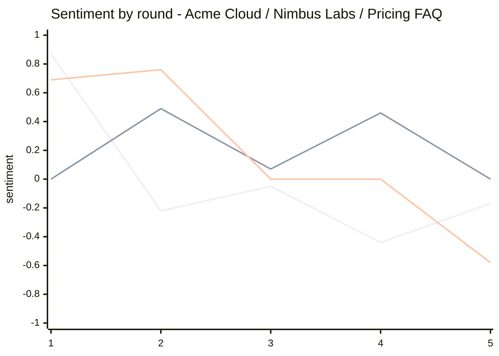
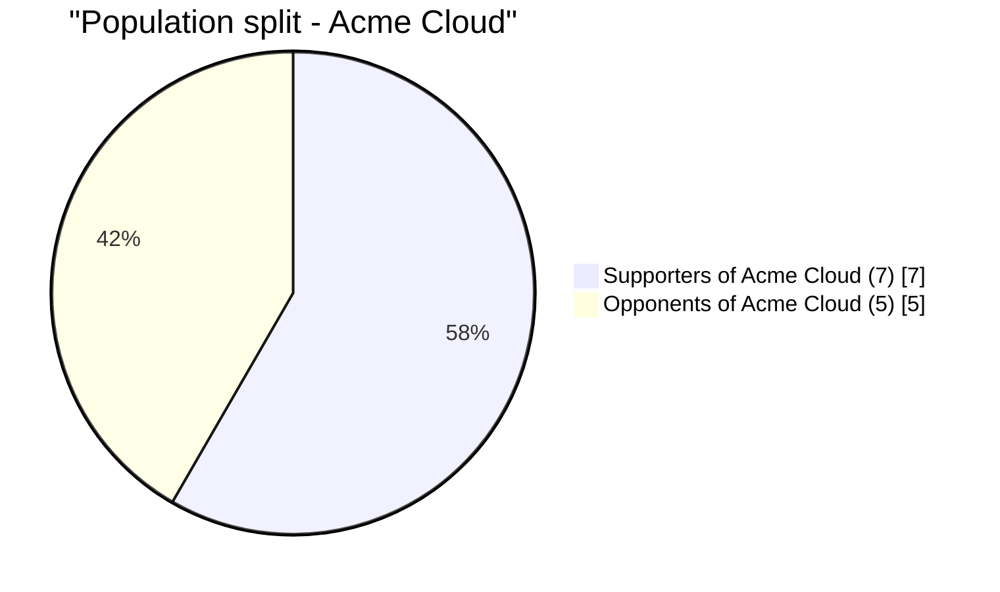
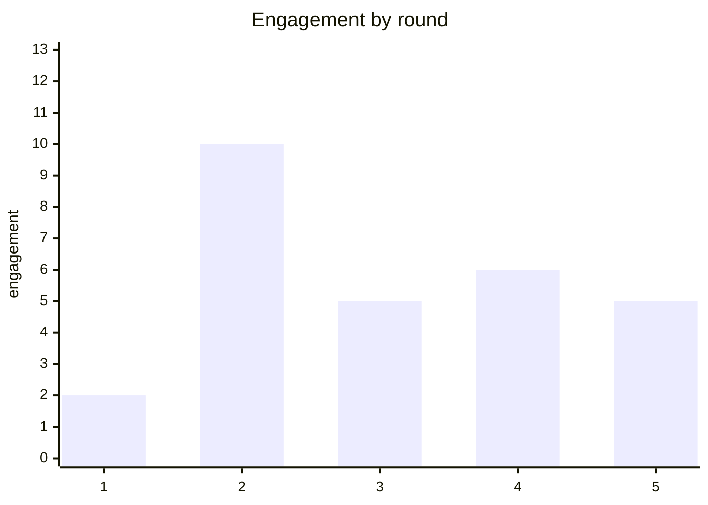

# Murmur Prediction Report — pricing-reaction

> How will developers react to the Pro plan price change?

**Version** 1 · **Scenario** `pricing-reaction` · **Generated** 2026-09-26 · **Seed** `acme-demo-2026`

**Rounds** 5 · **Population** 12 personas · **Ontology** 14 entities · **Platforms** Twitter + Reddit

**Focus** — developer reaction to the pricing change

> Deterministic statistics computed by the Murmur engine; narrative drafted by the host coding agent around those numbers. Reproduce this report by re-running world `pricing-reaction` with seed `acme-demo-2026` and the same host model — every number below is a pure function of the recorded run.

---

## At a Glance

| Simulated posts | Total engagement | Escalation chains | Viral posts | Controversy | Momentum | Most-discussed entity |
|---|---|---|---|---|---|---|
| 24 | 28 | 0 | 0 | **contested** 44/100 | accelerating (+33%) | Acme Cloud |

**Verdict —** 7 supporters vs 5 opponents around Acme Cloud (0 still undecided) — the population is deeply polarized. Controversy reads **contested** (44/100).

## 1. Executive Summary

The simulated crowd is contested (controversy 44/100): 7 supporters against 5 opponents around Acme Cloud, with 0 personas still undecided — the persuadable middle is 0% of the population. Sentiment toward Acme Cloud ended -0.17 (from +0.87, souring); engagement is accelerating at +33% between halves of the run. No post crossed the virality threshold — reach stayed inside the follow graph, which limits how far any single frame can travel. The strongest signal in the run is hype hardening around Pricing FAQ; the risk register below details what to do about it before this plays out in public.

## 2. Scenario & Population

Simulated 12 personas across 14 ontology entities for 5 rounds of dual-platform mechanics, with 1 injected news event stress-testing the reaction. The population split 7 supporters vs 5 opponents (0 undecided) around Acme Cloud, producing 24 posts and 28 engagement events.

### Entities under watch

| Entity | Type | Salience | Mentions | Motive |
|---|---|---|---|---|
| Pro Plan Pricing | topic | 0.90 | 0 | the debate around Pro Plan Pricing turns on who pays for reliability |
| Pricing FAQ | topic | 0.86 | 5 | the debate around Pricing FAQ turns on value versus lock-in |
| Pricing Release | topic | 0.81 | 3 | the debate around Pricing Release turns on value versus lock-in |
| Acme Cloud | org | 0.77 | 15 | Acme Cloud wants to avoid backlash |
| Nimbus Labs | org | 0.72 | 8 | Nimbus Labs wants to avoid backlash |
| Free Tier | topic | 0.68 | 2 | the debate around Free Tier turns on fairness to early users |
| Pricing Change | topic | 0.63 | 0 | the debate around Pricing Change turns on fairness to early users |
| Existing Customers | topic | 0.59 | 0 | the debate around Existing Customers turns on who pays for reliability |

### Population mix

| Archetype | Personas | Platforms |
|---|---|---|
| casual scroller | 2 | reddit + twitter |
| curious newcomer | 2 | both + twitter |
| industry professional | 2 | twitter |
| passionate advocate | 2 | both + reddit |
| power user | 2 | twitter |
| pragmatic skeptic | 2 | reddit |

### Injected events

| Round | Event |
|---|---|
| 3 | Nimbus Labs announces a one-click import tool that undercuts Acme Cloud pricing by 30% |

## 3. Key Findings

1. **The population split 7/5/0 (support/oppose/undecided) — polarization 92/100, controversy 44/100 (contested).**
2. **Sentiment toward Acme Cloud ran +0.87 → -0.17 over 5 rounds (souring); peak discourse volume hit round 3.**
3. **Engagement is accelerating (+33% second half vs first) — the crowd is leaning in, not tuning out.**
4. **Zero viral posts: the run's reach is bounded by the follow graph — narratives are competing in a closed room.**
5. **Twitter and Reddit disagree most on Nimbus Labs (Δ 0.88) — the same facts are producing different verdicts per platform.**

## 4. Market Reaction

### Sentiment toward the top entities



Lines, in chart order: **Acme Cloud**, **Nimbus Labs**, **Pricing FAQ**.

### Entity trend

| Entity | Type | First reading | Last reading | Δ | Direction | Mentions | Peak round |
|---|---|---|---|---|---|---|---|
| Pricing FAQ | topic | +0.69 | -0.58 | -1.27 | ↓ worsening | 5 | 1 |
| Pricing Release | topic | -0.54 | -0.58 | -0.04 | → flat | 3 | 4 |
| Acme Cloud | org | +0.87 | -0.17 | -1.04 | ↓ worsening | 15 | 3 |
| Nimbus Labs | org | 0.00 | +0.46 | +0.46 | ↑ improving | 8 | 2 |
| Free Tier | topic | +0.32 | +0.32 | 0.00 | → flat | 2 | 4 |

Engagement is **accelerating** — 12 in the first half of the run vs 16 in the second (+33%).

### What the crowd actually said about Acme Cloud

**Champions said**

> **po_14** · @ben1 · twitter · round 3 · sentiment toward Acme Cloud +0.76 · engagement 2
>
> Screaming into the void but: y'all are big mad about the 30% thing but Acme Cloud literally never crashes for me?? meanwhile Nimbus Labs ate my project files in 2023 and we all just moved on This is a win for the…

> **po_17** · @jonas9 · twitter · round 3 · sentiment toward Acme Cloud +0.58 · engagement 0
>
> I've defended Acme Cloud in a hundred threads. I can't defend 30% with a straight face. The trust we built is being spent by people who never posted here. See you in the replies.

> **po_3** · @elena4 · reddit · round 1 · sentiment toward Acme Cloud +0.76 · engagement -3
>
> small win: deployed my first project on Acme Cloud today and it worked on the first try. first try!! I'm going to be insufferable about this for a week still learning, thanks for patience.

**Critics said**

> **po_15** · @felix5 · twitter · round 3 · sentiment toward Acme Cloud -0.58 · engagement 2
>
> Following up from earlier: The 30% move puts Acme Cloud in an awkward middle: too expensive for hobbyists, not enterprise-grade for the big migrations. Someone in that pricing meeting miscalculated.

> **po_19** · @ada0 · twitter · round 4 · sentiment toward Acme Cloud -0.76 · engagement 1
>
> Everyone dunking on the 30% increase is missing it: the free-tier limits are the real lock-in play. Acme Cloud knows exactly what they're doing, and I hate that I get it. Receipts in thread.

> **po_27** · @jonas9 · reddit · round 5 · sentiment toward Acme Cloud -0.54 · engagement 0
>
> PSA: We made Acme Cloud what it is — the guides, the plugins, the conference talks, all unpaid — and the thank-you is 30% more per month? That's a betrayal, plain and simple.

**On the fence**

> **po_21** · @felix5 · twitter · round 4 · sentiment toward Acme Cloud 0.00 · engagement 3
>
> Acme Cloud's 30% increase reads as a margin defense, not a product bet. Expect churn in the prosumer segment first — and Pricing Release's timing with their importer is not a coincidence.

> **po_28** · @kira10 · twitter · round 5 · sentiment toward Acme Cloud 0.00 · engagement 2
>
> probably an unpopular take from the new guy: 30% for Acme Cloud still seems like a lot of value? everyone in my cohort uses the free tier anyway, am I missing something 3 followers and counting.

> **po_20** · @elena4 · twitter · round 4 · sentiment toward Acme Cloud 0.00 · engagement 1
>
> probably an unpopular take from the new guy: 30% for Acme Cloud still seems like a lot of value? everyone in my cohort uses the free tier anyway, am I missing something

## 5. Faction Map



Polarization: **92/100** — the population has hardened into opposing camps.

### Supporters of Acme Cloud — 7 personas (58%)

`██████████████░░░░░░░░░░`

Average stance +0.63 · 11 posts · 16 engagement received.

**Leading voices:** @ben1 (casual scroller, stance +0.67, 3 posts) · @kira10 (curious newcomer, stance +0.67, 3 posts) · @liam11 (industry professional, stance +0.66, 1 posts)

> **po_7** · @ben1 · twitter · round 2 · sentiment toward Acme Cloud +0.32 · engagement 0
>
> everyone migrating because of the 30% thing… I'll keep my stuff exactly where it works. Acme Cloud has been good to me and I'm too tired for a weekend of config this is not financial advice.

> **po_3** · @elena4 · reddit · round 1 · sentiment toward Acme Cloud +0.76 · engagement -3
>
> small win: deployed my first project on Acme Cloud today and it worked on the first try. first try!! I'm going to be insufferable about this for a week still learning, thanks for patience.

Faction sentiment toward Acme Cloud moved from +0.76 (round 1) to 0.00 (round 5).

### Opponents of Acme Cloud — 5 personas (42%)

`██████████░░░░░░░░░░░░░░`

Average stance -0.62 · 13 posts · 12 engagement received.

**Leading voices:** @felix5 (industry professional, stance -0.65, 4 posts) · @ada0 (power user, stance -0.64, 3 posts) · u/hugo7 (casual scroller, stance -0.68, 3 posts)

> **po_8** · @felix5 · twitter · round 2 · sentiment toward Acme Cloud -0.76 · engagement 1
>
> Screaming into the void but: Advising my clients to model 30% churn risk on Acme Cloud before renewing. The six-month grandfather window suggests their own team expects exactly that.

> **po_13** · @ada0 · twitter · round 3 · sentiment toward Acme Cloud -0.54 · engagement 0
>
> Four years of advocating Acme Cloud in every architecture review, and the thank-you is 30% more for the same plan. That's a paywall on loyalty. Evaluating Pricing Release this weekend.

Faction sentiment toward Acme Cloud moved from -0.76 (round 2) to -0.27 (round 5).

## 6. Platform Divergence

| Metric | Twitter | Reddit |
|---|---|---|
| Posts | 21 | 7 |
| Engagement | 30 | -2 |
| Escalation chains | 0 | 0 |

| Entity | Twitter sentiment | Reddit sentiment | Divergence |
|---|---|---|---|
| Nimbus Labs | +0.59 (5 posts) | -0.29 (3 posts) | 0.88 |
| Pricing FAQ | +0.64 (3 posts) | +0.17 (2 posts) | 0.47 |
| Acme Cloud | -0.18 (12 posts) | +0.01 (3 posts) | 0.19 |
| Free Tier | +0.32 (2 posts) | — (0 posts) | 0.00 |
| Pricing Release | -0.57 (3 posts) | — (0 posts) | 0.00 |

The largest split is **Nimbus Labs** (Δ 0.88 between platforms) — the same story is landing differently on Twitter than on Reddit, which usually means different framings are winning in each venue.

## 7. Persona Spotlight

### Felix Moreau (@felix5) — industry professional

*industry professional who argues about pricing on the internet.*

4 posts · 9 engagement received · platform twitter · arc: **warmed to Acme Cloud** (stance -0.77 → -0.65, shift +0.12)

```
before ████████··|··········
after  ███████···|··········
```
> **po_21** · @felix5 · twitter · round 4 · sentiment toward Acme Cloud 0.00 · engagement 3
>
> Acme Cloud's 30% increase reads as a margin defense, not a product bet. Expect churn in the prosumer segment first — and Pricing Release's timing with their importer is not a coincidence.

### Ben Sørensen (@ben1) — casual scroller

*casual scroller who lives in release notes.*

3 posts · 6 engagement received · platform twitter · arc: **steadfast champion of Acme Cloud** (stance +0.73 → +0.67, shift -0.06)

```
before ··········|···███████
after  ··········|···███████
```
> **po_14** · @ben1 · twitter · round 3 · sentiment toward Acme Cloud +0.76 · engagement 2
>
> Screaming into the void but: y'all are big mad about the 30% thing but Acme Cloud literally never crashes for me?? meanwhile Nimbus Labs ate my project files in 2023 and we all just moved on This is a win for the…

### Kira Novak (@kira10) — curious newcomer

*curious newcomer who argues about pricing on the internet.*

3 posts · 6 engagement received · platform twitter · arc: **steadfast champion of Acme Cloud** (stance +0.70 → +0.67, shift -0.03)

```
before ··········|···███████
after  ··········|···███████
```
> **po_28** · @kira10 · twitter · round 5 · sentiment toward Acme Cloud 0.00 · engagement 2
>
> probably an unpopular take from the new guy: 30% for Acme Cloud still seems like a lot of value? everyone in my cohort uses the free tier anyway, am I missing something 3 followers and counting.

## 8. Trajectory Simulated Projection

**Simulated projection — seeded ensemble of 5 runs.** Each run refits the observed curve with per-run slope jitter (seeds `acme-demo-2026:0`…`acme-demo-2026:4`). Recorded rounds are identical in every run, so the band only opens on projected rounds — it quantifies model spread, not real-world uncertainty.

| Round | P10 | P50 | P90 |
|---|---|---|---|
| 1 | +0.87 | +0.87 | +0.87 |
| 2 | -0.22 | -0.22 | -0.22 |
| 3 | -0.05 | -0.05 | -0.05 |
| 4 | -0.44 | -0.44 | -0.44 |
| 5 | -0.17 | -0.17 | -0.17 |
| 6 | -0.82 | -0.77 | -0.60 |
| 7 | -1.00 | -1.00 | -0.80 |

The engine's least-squares extrapolation puts Acme Cloud at -0.69 by round 6, -0.92 by round 7 if nothing new lands (slope -0.23/round, direction down). Momentum is accelerating (+33%), so the near future is a tug-of-war between 7 committed supporters and 5 committed opponents over a 0-persona middle. No escalation chains formed — disagreement is staying flat instead of threading, which caps how fast either camp can recruit. The realistic branch: sentiment keeps drifting down as migration-friction posts compound, until the next injected event resets the board. Watch the triggers in the risk register — they are the earliest signals of which branch wins.

## 9. Risk Register

| # | Risk | Severity | Likelihood | Evidence |
|---|---|---|---|---|
| R1 | Hype hardening around Pricing FAQ | MEDIUM | MEDIUM | `po_4`, `po_9`, `po_1` |
| R2 | Platform-split narrative on Nimbus Labs | HIGH | MEDIUM | `po_1`, `po_11` |
| R3 | Unmuted cluster around @kira10's tweet | LOW | MEDIUM | `po_10`, `po_11`, `po_9` |

### R1. Hype hardening around Pricing FAQ

**Severity** MEDIUM · **Likelihood** MEDIUM

Across 5 rounds, posts about Pricing FAQ clustered at sentiment +0.99 (strongest: po_4 by u/hugo7, engagement 0), and 7 of 12 personas now sit in support. The supportive cluster is collecting engagement faster than the critics (16 vs 12), which hardens the champion narrative. If this pattern survives contact with the real launch, it becomes the default framing within days.

**Mitigation —** Bank the goodwill: arm the @ben1 cohort with early access and migration proof-points before the wider rollout, so the champion narrative carries data instead of vibes.

**Early-warning trigger —** Champion posts out-earning critical posts by 3:1 for two consecutive cycles — that is complacency fuel.

**Evidence from the run:**

> **po_4** · Hugo Álvarez (u/hugo7) · reddit · round 1 · sentiment +0.91 · engagement 0
>
> genuinely loving the Pricing FAQ update, it fixed the one thing I actually complained about, no notes Solid decision, no notes.

> **po_9** · Grace Kim (@grace6) · twitter · round 2 · sentiment +0.76 · engagement 3
>
> Finally someone gets it. The Pricing FAQ discourse keeps skipping the part where the actual constraints live. Solid decision, no notes. Ask me how I know!

> **po_1** · Ben Sørensen (@ben1) · twitter · round 1 · sentiment +0.58 · engagement 4
>
> Screaming into the void but:  scrolled past 40 Pricing FAQ takes today and mine is the only correct one: it's fine, it's actually nice

### R2. Platform-split narrative on Nimbus Labs

**Severity** HIGH · **Likelihood** MEDIUM

The same story is landing differently by venue: Nimbus Labs reads +0.59 on Twitter versus -0.29 on Reddit (divergence 0.88). Cross-posted screenshots let the angrier venue set the frame for both, and the calmer venue's arguments never catch up — the run's escalation chains concentrated where the heat was.

**Mitigation —** Run the venues as separate campaigns: long-form receipts where the skepticism lives (Reddit), fast empathy where the heat lives (Twitter). Never answer a Reddit thread with a Twitter screenshot.

**Early-warning trigger —** Cross-platform screenshots of the same quote framed by opposite narratives — the split going public.

**Evidence from the run:**

> **po_1** · Ben Sørensen (@ben1) · twitter · round 1 · sentiment +0.58 · engagement 4
>
> Screaming into the void but:  scrolled past 40 Pricing FAQ takes today and mine is the only correct one: it's fine, it's actually nice

> **po_11** · Liam Byrne (@liam11) · twitter · round 2 · sentiment +0.32 · engagement 4
>
> Nimbus Labs timing a 30% undercut with import tooling is a textbook land grab. Expect the price-sensitive tier to move within a quarter. Impressive execution.

### R3. Unmuted cluster around @kira10's tweet

**Severity** LOW · **Likelihood** MEDIUM

Post po_10 (round 2, sentiment +0.58, engagement 3) keeps resurfacing in feeds across the run. High-salience anchors like this survive their news cycle and quietly set baselines for every later conversation about the same topic.

**Mitigation —** Answer the post directly and publicly — a considered reply to the anchor outperforms broadcast messaging for this crowd, and starves the thread of the silence it feeds on.

**Early-warning trigger —** The anchor post being quoted by a handle with no prior stance on the topic — neutral reach turning partisan.

**Evidence from the run:**

> **po_10** · Kira Novak (@kira10) · twitter · round 2 · sentiment +0.58 · engagement 3
>
> is Nimbus Labs seriously 30% cheaper?? my whole cohort is sharing the import link — does anyone know if it's actually good? genuinely curious

> **po_11** · Liam Byrne (@liam11) · twitter · round 2 · sentiment +0.32 · engagement 4
>
> Nimbus Labs timing a 30% undercut with import tooling is a textbook land grab. Expect the price-sensitive tier to move within a quarter. Impressive execution.

> **po_9** · Grace Kim (@grace6) · twitter · round 2 · sentiment +0.76 · engagement 3
>
> Finally someone gets it. The Pricing FAQ discourse keeps skipping the part where the actual constraints live. Solid decision, no notes. Ask me how I know!

## 10. Recommendations

**1. Answer the loudest cluster with specifics.** Take the strongest  grievance thread head-on: publish the grandfathering math, name the amnesty terms, and route the FAQ to the critics' platform of choice within 48 hours of the real announcement.

*Expected impact:* Converts a share of the 42% opposition before it hardens; historically blunts the first-week backlash curve.

**2. Arm the @ben1 cohort.** Give the top supporters early access, migration proof-points and quotable numbers before the wider rollout — let the 58% supporter base carry the narrative with evidence instead of enthusiasm.

*Expected impact:* Raises organic positive amplification and gives undecided personas a data-backed alternative frame to adopt.

**3. Instrument the triggers, not the sentiment.** Stand up monitoring for the three early-warning triggers in the risk register (repeated complaint phrasing, thread-depth escalation, cross-platform screenshot splits) with a named owner per platform and a one-hour response rule for anything firing.

*Expected impact:* Catches the inflection points while they are still single threads — the simulation shows the crowd amplifies within one round.

## 11. Confidence & Limitations

**Strong signals** (multiple posts, consistent sentiment):

- Sentiment toward Acme Cloud is souring with per-round consistency (+0.87 → -0.17).
- Engagement concentrated on a small set of high-salience voices (@felix5, @kira10, @ben1).

**Contested** (population split):

- Both camps are fully dug in with no undecided middle left — the next shift will come from outside events, not persuasion.
- Platforms diverge on Nimbus Labs (Twitter +0.59 vs Reddit -0.29) — severity is contested, not direction.

**Limitations:**

- A 12-persona simulation is directional, not a census; treat percentages as tendencies with wide error bars.
- Sentiment is lexical over simulated text — irony and coded language can under- or over-score.
- Extrapolations assume no new external events; real launches rarely get that courtesy.

## Timeline of the Run — the moments a launch team would replay

- **Round 1** · flashpoint: First strong criticism: u/cara2 — "Nimbus Labs panic index, my proprietary metric, just hit 'blog post imminent'. Historically that means the actual…" (`po_2`)
- **Round 1** · rally: First strong endorsement: @ben1 — "Screaming into the void but:  scrolled past 40 Pricing FAQ takes today and mine is the only correct one: it's fine,…" (`po_1`)
- **Round 3** · news: News injected into the world: Nimbus Labs announces a one-click import tool that undercuts Acme Cloud pricing by 30%
- **Round 3** · shift: @ben1 shifted on Nimbus Labs: -0.70 → -0.54
- **Round 3** · shift: u/hugo7 shifted on Nimbus Labs: 0.79 → 0.64

## Appendix A — Round-by-Round Statistics

| Round | Twitter | Reddit | Engagement | Escalations | Injections | Lurkers |
|---|---|---|---|---|---|---|
| 1 | 3 | 3 | 2 | 0 | 0 | 0 |
| 2 | 6 | 0 | 10 | 0 | 0 | 0 |
| 3 | 5 | 1 | 5 | 0 | 1 | 0 |
| 4 | 4 | 1 | 6 | 0 | 0 | 1 |
| 5 | 3 | 2 | 5 | 0 | 0 | 0 |




## Appendix B — Escalation Chains

No escalation chains formed this run — disagreement stayed at post level instead of threading into reply spirals. That caps how fast either camp can recruit: intensity has nowhere to compound.

## Appendix C — Amplification

No post crossed the virality threshold this run — reach stayed inside the follow graph.

Organic (engine-simulated bystander) engagement share: **0%** — the rest came from activated personas engaging each other's content.

## Appendix D — Post Index (evidence)

| Id | By | Plat | R | Sentiment | Engagement | Excerpt |
|---|---|---|---|---|---|---|
| po_1 | Ben Sørensen (@ben1) | tw | 1 | +0.58 | 4 | Screaming into the void but:  scrolled past 40 Pricing FAQ takes today and mine is the… |
| po_11 | Liam Byrne (@liam11) | tw | 2 | +0.32 | 4 | Nimbus Labs timing a 30% undercut with import tooling is a textbook land grab. Expect… |
| po_10 | Kira Novak (@kira10) | tw | 2 | +0.58 | 3 | is Nimbus Labs seriously 30% cheaper?? my whole cohort is sharing the import link — does… |
| po_21 | Felix Moreau (@felix5) | tw | 4 | -0.58 | 3 | Acme Cloud's 30% increase reads as a margin defense, not a product bet. Expect churn in… |
| po_25 | Felix Moreau (@felix5) | tw | 5 | 0.00 | 3 | Actually important: From the inside: a 30% undercut plus working migration tooling is… |
| po_9 | Grace Kim (@grace6) | tw | 2 | +0.76 | 3 | Finally someone gets it. The Pricing FAQ discourse keeps skipping the part where the… |
| po_14 | Ben Sørensen (@ben1) | tw | 3 | +0.89 | 2 | Screaming into the void but: y'all are big mad about the 30% thing but Acme Cloud… |
| po_15 | Felix Moreau (@felix5) | tw | 3 | -0.58 | 2 | Following up from earlier: The 30% move puts Acme Cloud in an awkward middle: too… |
| po_28 | Kira Novak (@kira10) | tw | 5 | +0.32 | 2 | probably an unpopular take from the new guy: 30% for Acme Cloud still seems like a lot… |
| po_16 | Hugo Álvarez (u/hugo7) | rd | 3 | -0.76 | 1 | the Nimbus Labs comments on this sub never miss. y'all turned a pricing email into a… |
| po_19 | Ada Okafor (@ada0) | tw | 4 | -0.93 | 1 | Everyone dunking on the 30% increase is missing it: the free-tier limits are the real… |
| po_20 | Elena Rossi (@elena4) | tw | 4 | +0.32 | 1 | probably an unpopular take from the new guy: 30% for Acme Cloud still seems like a lot… |
| po_22 | Ines Duarte (u/ines8) | rd | 4 | +0.46 | 1 | Suspicious of hype in both directions, but Nimbus Labs at 30% more with the roadmap… |
| po_5 | Kira Novak (@kira10) | tw | 1 | +0.58 | 1 | small win: deployed my first project on Nimbus Labs today and it worked on the first… |
| po_8 | Felix Moreau (@felix5) | tw | 2 | -0.76 | 1 | Screaming into the void but: Advising my clients to model 30% churn risk on Acme Cloud… |
| po_13 | Ada Okafor (@ada0) | tw | 3 | -0.54 | 0 | Four years of advocating Acme Cloud in every architecture review, and the thank-you is… |
| po_17 | Jonas Weber (@jonas9) | tw | 3 | +0.58 | 0 | I've defended Acme Cloud in a hundred threads. I can't defend 30% with a straight face.… |
| po_24 | Ada Okafor (@ada0) | tw | 5 | 0.00 | 0 | Update from my last post: The 30% hike isn't even the problem. Shipping it in a… |
| po_26 | Hugo Álvarez (u/hugo7) | rd | 5 | -0.58 | 0 | Ok hear me out: welp. 30% more for Acme Cloud? guess I'm finally reading that Pricing… |
| po_27 | Jonas Weber (@jonas9) | rd | 5 | -0.26 | 0 | PSA: We made Acme Cloud what it is — the guides, the plugins, the conference talks, all… |
| po_4 | Hugo Álvarez (u/hugo7) | rd | 1 | +0.91 | 0 | genuinely loving the Pricing FAQ update, it fixed the one thing I actually complained… |
| po_7 | Ben Sørensen (@ben1) | tw | 2 | +0.32 | 0 | everyone migrating because of the 30% thing… I'll keep my stuff exactly where it works.… |
| po_2 | Cara Lindqvist (u/cara2) | rd | 1 | -0.58 | -1 | Nimbus Labs panic index, my proprietary metric, just hit 'blog post imminent'.… |
| po_3 | Elena Rossi (@elena4) | rd | 1 | +0.87 | -3 | small win: deployed my first project on Acme Cloud today and it worked on the first try.… |

## Appendix E — Methodology & Reproducibility

Each round the engine activated a weighted subset of the 12-persona population, composed personalized feeds from the follow graph and platform mechanics, and the host LLM wrote posts, replies and votes in character. Organic engagement, virality, stance migration (10%/round toward expressed sentiment), pairwise influence over the follow graph (Deffuant bounded confidence: ε=0.4, μ=0.2, 10% chance of slight disengagement beyond ε) and escalation chains are deterministic functions of the recorded run. Sentiment is a lexical score over real post text, attributed to entities by mention. The report narrative was drafted by the host coding agent against the statistics pack; every quoted post id resolves to a stored post.

**Reproduce:** initialize a world with seed `acme-demo-2026`, attach the same seeds, and drive the same host model through the plan/submit protocol. The engine's state — and therefore every number in this report — replays identically.

**Leaderboard (top voices):** @felix5 (industry professional, 4 posts, 9 engagement) · @kira10 (curious newcomer, 4 posts, 6 engagement) · @ben1 (casual scroller, 3 posts, 6 engagement) · @liam11 (industry professional, 1 posts, 4 engagement) · @grace6 (power user, 2 posts, 3 engagement) · @ada0 (power user, 5 posts, 1 engagement) · u/hugo7 (casual scroller, 3 posts, 1 engagement) · u/ines8 (pragmatic skeptic, 1 posts, 1 engagement)
